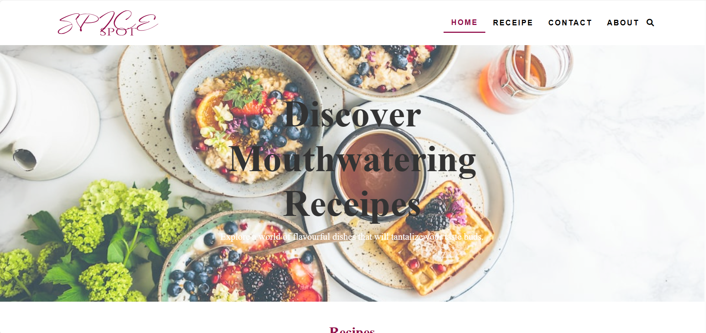

# Recipe Website

This is a recipe website. This challenge help me to improve my coding skills. 

## Table of contents
  - [Screenshot](#screenshot)
  - [Links](#links)
  - [Built with](#built-with)
  - [What I learned](#what-i-learned)
  - [Author](#author)


### Screenshot




### Links

- URL: [GitHub](https://github.com/madu-99/Receipe-Website)
- Live Site URL: [Netlify](https://receipe-website.netlify.app/)


### Built with

- Semantic HTML5 markup
- CSS custom properties
- CSS Grid
- Mobile-first workflow
- Bootstrap 5


### What I learned

```Js
function showSlides(n) {
  var i;
  var slides = document.getElementsByClassName("slides");
  var dots = document.getElementsByClassName("dot");
  if (n > slides.length) {slideIndex = 1}
    if (n < 1) {slideIndex = slides.length}
    for (i = 0; i < slides.length; i++) {
      slides[i].style.display = "none";
    }
    for (i = 0; i < dots.length; i++) {
      dots[i].className = dots[i].className.replace(" active", "");
    }
  slides[slideIndex-1].style.display = "block";
  dots[slideIndex-1].className += " active";
}
```


## Author

- Website - [Madumali Kanchana](https://github.com/madu-99/Receipe-Website.git)

